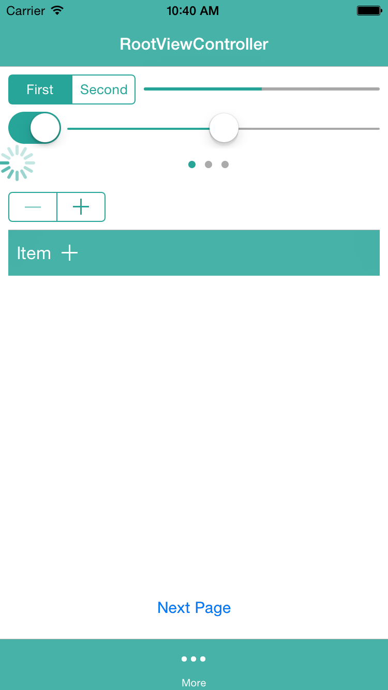

# HaidoraThemeKit
UIKit appearance 的封装。



## Usage

To run the example project, clone the repo, and run `pod install` from the Example directory first.

```
Objective-C

#import <HaidoraThemeKit/HaidoraThemeKit-Swift.h>
//or #import <XXX-Swift.h>

[HDThemeKit setupThemeWithPrimaryColor:[UIColor redColor] secondaryColor:[UIColor whiteColor]];

//自定义某一类
[UIXXX applyHDTheme:XXX]

Swift

HDThemeKit.setupTheme() 
//or HDThemeKit.setupTheme(primaryColor: UIColor(red:0.314, green:0.420, blue:0.471, alpha: 1), secondaryColor: UIColor.whiteColor())

//自定义某一类
UIXXX.applyHDTheme(XXX)

```

## Installation

###CocoaPods

HaidoraThemeKit is available through [CocoaPods](http://cocoapods.org). To install
it, simply add the following line to your Podfile:

```ruby
pod "HaidoraThemeKit"
```
* iOS 8.0+

###CocoaSeeds
可以通过[CocoaSeeds](https://github.com/devxoul/CocoaSeeds)来安装。Seedfile如下:
```
github "Haidora/HaidoraThemeKit", "0.1.0", :files => "Pod/Classes/*.{swift,h}"
```
* iOS 7.0+

###Manually

[Download the latest tag](https://github.com/Haidora/HaidoraThemeKit/tags) and drag the sources into your Xcode project.

## 进度

### `UIActivityIndicatorView`
- [x] `UIActivityIndicatorView.appearance().activityIndicatorViewStyle` - activityIndicatorViewStyle   
- [x] `UIActivityIndicatorView.appearance().color` - activityColor   

### `UINavigationBar`
- [x] `UINavigationBar.appearance().tintColor` - navigationItemColor
- [x] `UINavigationBar.appearance().barTintColor` - navigationBackground
- [x] `UINavigationBar.appearance().barStyle` - navigationBarStyle
- [x] `UINavigationBar.appearance().titleTextAttributes.NSForegroundColorAttributeName` - navigationTitleColor
- [x] `UINavigationBar.appearance().titleTextAttributes.NSFontAttributeName ` - navigationTitleFont

### `UIPageControl`
- [x] `UIPageControl.appearance().currentPageIndicatorTintColor` - currentPageIndicatorColor
- [x] `UIPageControl.appearance().pageIndicatorTintColor` - pageIndicatorColor

### `UIProgressView`
- [x] `UIProgressView.appearance().progressTintColor` - progressTintColor
- [x] `UIProgressView.appearance().trackTintColor` - trackColor
- [x] `UIProgressView.appearance().progressImage` - progressImage
- [x] `UIProgressView.appearance().trackImage` - trackImage
- [x] `UIProgressView.appearance().progressViewStyle` - progressViewStyle

### `UISegmentedControl`
- [x] `UISegmentedControl.appearance().tintColor` - tintColor

### `UISlider`
- [x] `UISlider.appearance().minimumTrackTintColor` - minimumTrackTintColor
- [x] `UISlider.appearance().thumbTintColor` - thumbTintColor
- [x] `UISlider.appearance().maximumTrackTintColor` - maximumTrackTintColor 
- [x] `UISlider.appearance().minimumValueImage` - minimumValueImage
- [x] `UISlider.appearance().maximumValueImage` - maximumValueImage

### `UIStepper`
- [x] `UIStepper.appearance().tintColor` - tintColor

### `UISwitch`
- [x] `UISwitch.appearance().onTintColor` - turnedOnColor   
- [x] `UISwitch.appearance().thumbTintColor` - thumbTintColor   
- [x] `UISwitch.appearance().onTintColor` - tintColor  
- [x] `UISwitch.appearance().onImage` - onImage
- [x] `UISwitch.appearance().offImage` - offImage

### `UITabBar`
- [x] `UITabBar.appearance().barTintColor` - tabbarBackground   
- [x] `UITabBar.appearance().tintColor` - barItemTintColor
- [x] `UITabBar.appearance().barStyle` - barStyle
- [x] `UITabBar.appearance().translucent` - translucent

### `UIToolbar`
- [x] `UIToolbar.appearance().barTintColor` - toolbarBackground   
- [x] `UIToolbar.appearance().tintColor` - barItemTintColor
- [x] `UIToolbar.appearance().barStyle` - barStyle
- [x] `UIToolbar.appearance().translucent` - translucent

## Contact

[Mrdaios](mailto:mrdaios@gmail.com)

## License

HaidoraThemeKit is available under the MIT license. See the LICENSE file for more info.
